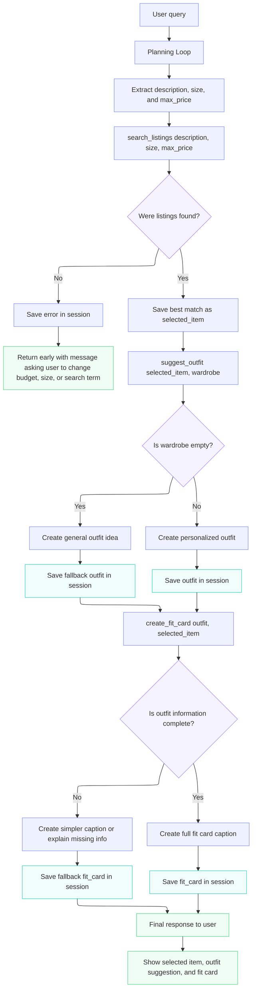

# FitFindr — planning.md

> Complete this document before writing any implementation code.
> Your spec and agent diagram are what you'll use to direct AI tools (Claude, Copilot, etc.) to generate your implementation — the more specific they are, the more useful the generated code will be.
> Your planning.md will be reviewed as part of your submission.
> Update it before starting any stretch features.

---

## Tools

List every tool your agent will use. For each tool, fill in all four fields.
You must have at least 3 tools. The three required tools are listed — add any additional tools below them.

### Tool 1: search_listings

**What it does:**
`search_listings` looks through the secondhand listings and finds items that are close to what the user is asking for. It checks details like the item title, description, tags, size, and price so the agent can recommend the best matches.

**Input parameters:**
- `description` (str): What the user wants to find, like `"vintage graphic tee"` or `"black boots"`.
- `size` (str | None): The size the user is looking for, like `"M"`, `"S/M"`, `"W30"`, or `"US 8"`. If the user does not give a size, this can be `None`.
- `max_price` (float | None): The most the user wants to spend. If the user does not give a budget, this can be `None`.

**What it returns:**
It returns a list of matching listings, with the best matches first. Each listing includes details like `id`, `title`, `description`, `category`, `style_tags`, `size`, `condition`, `price`, `colors`, `brand`, and `platform`.

**What happens if it fails or returns nothing:**
If nothing matches, the tool returns an empty list. The agent should tell the user that it could not find anything with those filters and suggest something helpful, like raising the budget, removing the size filter, or trying a broader search.

### Tool 2: suggest_outfit

**What it does:**
`suggest_outfit` helps figure out how the item could actually be worn. Once the agent finds a listing, this tool looks at the user's wardrobe and tries to build a realistic outfit around that item.

**Input parameters:**
- `new_item` (dict): The item the agent picked from the search results. This includes details like the title, category, colors, style tags, price, condition, and platform.
- `wardrobe` (dict): The user's closet information. It includes an `items` list with pieces they already own, like tops, bottoms, shoes, outerwear, and accessories.

**What it returns:**
It returns an outfit suggestion. The result should include the new item, the wardrobe pieces that go with it, and a short explanation of how the outfit would be styled.

**What happens if it fails or returns nothing:**
If the wardrobe is empty, the tool should not crash or pretend it has closet items to use. It should give a more general styling idea and let the user know that the suggestion would be better if they added a few wardrobe pieces.

---

### Tool 3: create_fit_card

**What it does:**
`create_fit_card` turns the outfit into a short caption the user could share or save. The goal is for it to sound like a real outfit caption, not a boring product description.

**Input parameters:**
- `outfit` (dict): The outfit suggestion from `suggest_outfit`, including the new item and the pieces styled with it.
- `new_item` (dict): The thrifted item being featured in the caption.

**What it returns:**
It returns a short caption as a string. The caption should mention the thrifted item and the overall vibe of the outfit, and it can include the price or platform if that makes the caption better.

**What happens if it fails or returns nothing:**
If the outfit information is missing, the tool should still make a simple caption using whatever it knows about the selected item. The agent should also be clear that the caption is less detailed because the outfit information was incomplete.

---

### Additional Tools (if any)

I am not adding extra tools right now. I want to get the three required tools working first before adding stretch features.

---

## Planning Loop

**How does your agent decide which tool to call next?**

The agent starts by reading the user's message and figuring out what they are looking for, including the item description, size, and budget if those are mentioned.

The first tool it uses is `search_listings`. If nothing comes back, the agent stops there and tells the user that no matching listings were found. It should also suggest what the user can change, like raising the budget, skipping the size filter, or searching for a more general item.

If the search does find listings, the agent picks the best match and saves it as the selected item. Then it sends that item, along with the user's wardrobe, to `suggest_outfit`.

If the outfit tool can use the wardrobe, the agent saves that outfit suggestion. If the wardrobe is empty, the agent still gives a general styling idea, but it explains that the outfit is not fully personalized yet.

After there is an outfit suggestion, the agent calls `create_fit_card` to make a short caption. At the end, the user should see the item the agent found, how to style it, and the fit card caption.

---

## State Management

**How does information from one tool get passed to the next?**

The agent will keep track of important information in a session while it is helping the user. This way, the result from one tool can be used by the next tool without asking the user to repeat anything.

For example, after `search_listings` finds results, the agent saves the best match as `selected_item`. Then `suggest_outfit` uses that saved item along with the user's wardrobe. After an outfit is created, the agent saves it as `outfit`, and `create_fit_card` uses both the outfit and the selected item to make the final caption.

The main things I want to track in the session are the original user request, the search details, the search results, the selected item, the wardrobe, the outfit suggestion, the fit card, and any error message.

---

## Error Handling

For each tool, describe the specific failure mode you're handling and what the agent does in response.

| Tool | Failure mode | Agent response |
|------|-------------|----------------|
| search_listings | No results match the query | The agent stops before trying to make an outfit. It tells the user that nothing matched and suggests changing something specific, like raising the budget, removing the size filter, or using a broader search term. |
| suggest_outfit | Wardrobe is empty | The agent gives a general styling suggestion instead of a personalized closet-based outfit. It also tells the user that the suggestion would be better if they added wardrobe items. |
| create_fit_card | Outfit input is missing or incomplete | The agent makes a simpler caption using the selected item if possible. If there is not enough information, it tells the user that it could not make a full fit card because the outfit details were missing. |

---

## Architecture

<!-- Draw a diagram of your agent showing how the components connect:
     User input → Planning Loop → Tools (search_listings, suggest_outfit, create_fit_card)
                                                                          ↕
                                                                   State / Session
     Show what triggers each tool, how state flows between them, and where error paths branch off.
     ASCII art, a Mermaid diagram (https://mermaid.js.org/syntax/flowchart.html), or an embedded
     sketch are all fine. You'll share this diagram with an AI tool when asking it to implement
     the planning loop and each individual tool. -->

## AI Tool Plan

<!-- For each part of the implementation below, describe:
     - Which AI tool you plan to use (Claude, Copilot, ChatGPT, etc.)
     - What you'll give it as input (which sections of this planning.md, your agent diagram)
     - What you expect it to produce
     - How you'll verify the output matches your spec before moving on

     "I'll use AI to help me code" is not a plan.
     "I'll give Claude my Tool 1 spec (inputs, return value, failure mode) and ask it to implement
     search_listings() using load_listings() from the data loader — then test it against 3 queries
     before trusting it" is a plan. -->

     

**Milestone 3 — Individual tool implementations:**

For Milestone 3, I will mainly use Claude to help me implement each tool one at a time. I may also use ChatGPT if I get stuck, want a second explanation, or need help checking whether the code matches my plan.

For `search_listings`, I will give Claude the Tool 1 section of this planning document and ask it to write the function using `load_listings()` from `utils/data_loader.py`. I will check that the function filters by description, size, and max price, and that it returns an empty list instead of crashing when there are no matches.

For `suggest_outfit`, I will give Claude the Tool 2 section and the wardrobe schema so it understands what the wardrobe data looks like. I expect it to write a function that takes a selected listing and a wardrobe, then returns an outfit suggestion. I will test it with both `get_example_wardrobe()` and `get_empty_wardrobe()`.

For `create_fit_card`, I will give Claude the Tool 3 section and ask it to create a function that turns an outfit into a short caption. I may use ChatGPT to help make the caption sound more natural if the first version sounds too robotic. I will test it with different items to make sure the captions change based on the input.

**Milestone 4 — Planning loop and state management:**
For Milestone 4, I will use Claude to help connect the tools into one agent flow. I will give Claude the Planning Loop section, State Management section, Error Handling table, and the Architecture diagram from this planning document.

I expect Claude to help write the planning loop that stores data in a session, calls `search_listings` first, stops early if no listings are found, calls `suggest_outfit` only after a listing is selected, and calls `create_fit_card` only after an outfit exists.

I may use ChatGPT to review the loop or explain any errors I run into while testing. I will verify the result by running one successful example that uses all three tools and one error example where `search_listings` returns no results. I will also check the code to make sure the agent does not continue to later tools when an earlier step fails.
---

## A Complete Interaction (Step by Step)

Write out what a full user interaction looks like from start to finish — tool call by tool call. Use a specific example query.

FitFindr helps a user find secondhand clothing items and decide how to style them with pieces they already own. The search tool is triggered first when the user describes what they want, the outfit suggestion tool is triggered after a valid listing is found, and the fit card tool is triggered after a complete outfit has been created. If any tool fails, FitFindr should explain the problem and either stop safely, try a fallback search, or ask the user for more information instead of continuing with missing data.

**Example user query:** "I'm looking for a vintage graphic tee under $30. I mostly wear baggy jeans and chunky sneakers. What's out there and how would I style it?"

**Step 1:**
<!-- What does the agent do first? Which tool is called? With what input? -->
The agent identifies the request: a vintage graphic tee under $30. Since no size is provided, it searches without a size filter.

**Step 2:**
The agent calls `search_listings("vintage graphic tee", size=None, max_price=30.0)`. If it finds matches, it selects the best one and saves it as `selected_item`. If no listings are found, the agent stops early and suggests adjusting the filters.

**Step 3:**
The agent calls `suggest_outfit(selected_item, wardrobe)` to create an outfit using the user’s wardrobe. If an outfit is created successfully, the agent saves it as `outfit` and then calls `create_fit_card(outfit, selected_item)` to generate a short, shareable caption.

**Final output to user:**
<!-- What does the user actually see at the end? -->
The user receives a recommended item, an outfit suggestion, and a fit card caption.
